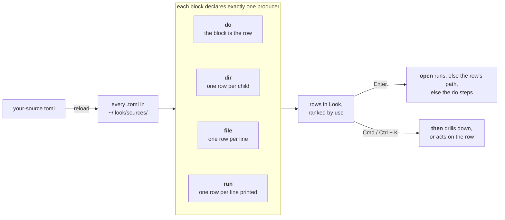

# lookbook

Ready-made **sources** and **tiles** for [Look](https://github.com/kunkka19xx/look).

Two kinds, because Look reads two files, and which one a thing goes into decides how you install it:

| | What it is | Lives in | Installed by |
| --- | --- | --- | --- |
| [**sources/**](sources) | your own rows in the launcher: repos, SSH hosts, containers, a morning routine | `~/.look/sources/*.toml`, read flat | copying a file in |
| [**tiles/**](tiles) | your own tiles on the Super Actions strip, the empty home screen | `~/.look/super-actions.toml`, one file | merging a block into it by hand |

One folder here is one topic, holding a README and one or more `.toml` files you can take independently.

New to either? The [sources format guide](https://github.com/kunkka19xx/look/blob/main/docs/user-sources.md) and the [Super Actions section](https://github.com/kunkka19xx/look/blob/main/docs/user-guide.md#super-actions) of the user guide are both short.

> **Sources need Look v0.6.12 or newer**, tiles and `applies` need **v0.6.13**. Earlier builds ignore what they do not know about, so nothing appears and nothing is reported. Not released yet: [build from source](https://github.com/kunkka19xx/look/blob/main/DEVELOPMENT.md) to try these today.

**_Tmux source in action_**  


## How a source works

One block, one producer key, rows in the launcher. That is the whole model:



Four things the picture leaves out:

- **A file holds as many blocks as you like**, one producer each. `sources/docker` is one file with three: a `run` block listing containers, and two `do` blocks it reaches with `then`.
- **A path row can do more than a text row.** `dir` rows are real filesystem objects, so `{path}`, `Cmd+E`, `Cmd+T` and `Cmd+F` work and Enter opens the folder with no `open` declared. `file` and `run` rows are text: give them an `open`, or `format = "json"` to carry a path and a per-row icon.
- **Every step is shell text**, run through your login shell (`$SHELL -lc`, or `cmd /D /S /C` on Windows), so `&&`, `|`, `>`, `$VAR` and globs work. That is a *non-interactive* shell: it never reads `~/.zshrc`, so a `PATH` entry or alias living there is missing, move it to `~/.zshenv`, or name the binary in full. fish and nu are passed over for `/bin/sh`. A script can read `LOOK_ID`, `LOOK_TITLE` and `LOOK_PATH` instead of taking arguments.
- **A producer that names a placeholder is not a top-level row.** `run = "git -C {path} branch"` means nothing with no project selected, so Look indexes it only as another block's `then` target.

In a real file: `[dev-projects]` is the block, `dir = "~/dev"` is the producer that turns your folders into rows, and `edit = "code {path}"` is what one of those rows does on `Cmd+E`.

## Install any example

A **source** is copied:

```bash
cp sources/<name>/*.toml ~/.look/sources/
```

Or copy a single file out of a folder if you only want that one.

A **tile** is merged, because `~/.look/super-actions.toml` is one file holding your whole strip. Put the tile's name in the `layout` drawing at the top, then paste its block onto the end. `make show NAME=<name>` prints what to paste; [tiles/README.md](tiles) has the walkthrough. There is deliberately no `make install` for tiles: a script that edited that file would be rearranging your strip.

Then reload Look either way: `Cmd+Shift+;` on macOS, `Ctrl+Shift+;` on Linux and Windows.

Copy only the `.toml`. Look reads `~/.look/sources/` flat, so it never looks inside subdirectories, and a stray `README.md` in there is reported as an ignored file. If an example ships a script in `bin/`, its README says where to put it.

## Change it to fit your machine

Every file here was written against somebody else's setup, and what makes an example useful is exactly what makes it personal: a projects directory, a terminal, an editor. Open the `.toml` and change those lines before you reload.

The five that catch people:

- **A name or alias that is already busy on your machine.** This one is silent and easy to miss. A block's `name` and `aliases` are what you type to reach its rows, and they compete with everything Look already indexes: your apps, files, folders, settings and history. `dev-projects` ships `aliases = ["repo", "git", "code"]`, and on a machine with a `~/code` folder or VS Code installed, typing `code` now returns a mixture. Nothing is broken and nothing is reported; the list is just muddier than it was. Prefer a word that is distinctive on **your** machine, and reach for `bias` only when you want a generic word anyway. See [Choosing what to type](#choosing-what-to-type) below.
- **A path that is not yours.** `dev-projects` lists `~/dev`. If your repos are in `~/code` or `~/work`, you get an empty list and nothing else.
- **An app you do not have.** `ssh` and `docker` open Ghostty, `homebrew` upgrades in it, `tmux` attaches with WezTerm, `work-setup` opens Slack, Ghostty and Safari, `dev-projects` edits with `code`.
- **`open`, which is macOS.** On Linux that is `xdg-open`, on Windows `start ""`. Most of these were tested on macOS only; the table below says which.
- **A file that has to be there.** `ssh` reads your `~/.ssh/config`. Anything shipping a `bin/` script needs that script in `~/.look/bin/` first, which its README tells you.

Each example's README has a **Customise** section naming the two or three lines people change first, with the Linux and Windows variants written out. That is the section to read before you reload.

**A mismatch is quiet in the UI.** A `dir` that is not there gives you an empty list, and Enter on a row naming an app you do not have does nothing at all. The reason goes to stderr rather than into the window, so launch Look from a terminal while you are setting these up:

```
look sources: [dev-projects] could not read /home/you/dev
```

Every line it prints starts `look sources:` and names the block, which is the fastest way to tell a source that is misconfigured from one that is simply empty.

### Choosing what to type

`name` and `aliases` are the block's handles. Two rules keep them out of the way of what is already on your machine:

- **Distinctive beats short.** A word that means something else to your computer costs you every time you type it. `notes`, `files`, `code`, `git`, `downloads` and `settings` all collide with something on a normal machine. `zk`, `worktrees` or `standup` collide with nothing.
- **Two words beat one.** `name = "tmux sessions"` is reachable by typing either word and matches far less than `sessions` alone.

If you do want a generic word, that is a ranking decision rather than a naming one, and `bias` is the knob: positive lifts the whole block above what it competes with, negative sinks it below. It applies to every query, not only the one you had in mind.

Block **ids** (the `[header]`) are a separate thing and do not affect what you type. They only have to be unique inside `~/.look/sources/`, which is why every example here prefixes them with its folder name. Rename a block id and it loses that block's usage history, so pick one and leave it.

## The sources

The **Platforms** column is what the author tested, not what might work. Where an example needs a change to run elsewhere, its README says which line.

<!-- index:sources -->
| Example                               | Tools      | Shows off                                                     | Platforms             |
| ------------------------------------- | ---------- | ------------------------------------------------------------- | --------------------- |
| [work-setup](sources/work-setup)     | none       | `do`: one row, several apps                                   | macOS                 |
| [dev-projects](sources/dev-projects) | none       | `dir`: rows from a directory, custom verbs                    | macOS, Linux, Windows |
| [ssh](sources/ssh)                   | ssh        | `run`: rows from a command, and the `file` alternative        | macOS                 |
| [git](sources/git)                   | git        | two files in one folder; drill-downs, `confirm`, `{parent.*}` | macOS, Linux, Windows |
| [docker](sources/docker)             | docker, jq | `format = "json"`, per-row icons, a helper script             | macOS                 |
| [tmux](sources/tmux)                 | tmux       | a `bin/` script doing real work; session per project          | macOS                 |
| [browser-history](sources/browser-history) | sqlite3    | `run` + `format = "json"`: favicons as per-row icons, browsers picked by env var | Linux, macOS          |
| [close-windows](sources/close-windows) | jq (Linux) | a multi-line `do` step; `confirm` on something irreversible; one file per OS | Linux (sway; more untested), macOS |
| [systemd](sources/systemd)           | systemd    | tab-separated rows, `preview` from a log, three guarded actions      | Linux                 |
| [bookmarks](sources/bookmarks)       | none       | `file`: a list you keep by hand, and the no-TOML script trick        | Linux                 |
| [shortcuts](sources/shortcuts) | none       | `run` with nothing to install; a `then` drill-down by folder         | macOS                 |
| [homebrew](sources/homebrew) | brew, jq   | two lists in one folder; `confirm` on Enter, and a `preview` that has to be fast | macOS                 |
| [niri](sources/niri)                 | niri, swww, wl-clipboard | image rows with previews; which block shape can warn a tool is missing | Linux (niri)          |
| [meeting](sources/meeting) | none       | `do` + `preview` for clock-dependent data that must not go stale | macOS                 |
| [archives](sources/archives) | tar, zip, unzip | `applies`: a verb on rows the block did not produce, by `match` glob | Linux |
| [images](sources/images) | oxipng, cwebp, ImageMagick | `applies` by `ext`, one block per tool that can actually act | Linux |
<!-- /index:sources -->

## The tiles

Tiles go on the Super Actions strip, and are **merged** into `~/.look/super-actions.toml` rather than copied. [tiles/README.md](tiles) is the walkthrough: what a tile can be, what the two-second cap means, and how icons and letters differ per platform.

<!-- index:tiles -->
| Tile | Requires | Shows off | Platforms |
| --- | --- | --- | --- |
| [disk](tiles/disk) | none | `value`: a readout with a caption and a second line, on a `refresh` | Linux |
| [lock](tiles/lock) | none | `press` with no `value`, a button, with `confirm`, `icon` and `mnemonic` | macOS, Linux |
| [sleep](tiles/sleep) | none | `press` with no `value`, a button with `confirm`, `icon` and `mnemonic` | macOS |
| [vpn](tiles/vpn) | NetworkManager | `state` for the on/off treatment, and printing nothing to hide the tile | Linux |
<!-- /index:tiles -->

## Read before you install

Every example runs shell commands on your machine when you press Enter. They are short and readable on purpose: **open the `.toml` and read it before you install it**, the same way you would read a shell script someone handed you. Nothing here downloads anything or pipes a URL into a shell, and anything destructive asks first.

Most of them touch only what you point them at. One does not, on purpose: [browser-history](sources/browser-history) finds your browser profiles by itself and makes your history searchable in the launcher, which is the whole idea but also the one thing here worth reading about **before** installing rather than after. Its README opens with what that means and how to narrow it.

## Contributing

Yes please. `make new NAME=tmux` scaffolds one with every rename already done. One folder per example, [the rules are short](CONTRIBUTING.md), and CI parses every file with Look's own parser so a typo cannot reach anyone. Two things we ask beyond that: **install it and use it before you commit** (parsing is not running), and **say which platforms you actually tested on**.

## License

MIT. Use these however you like.
