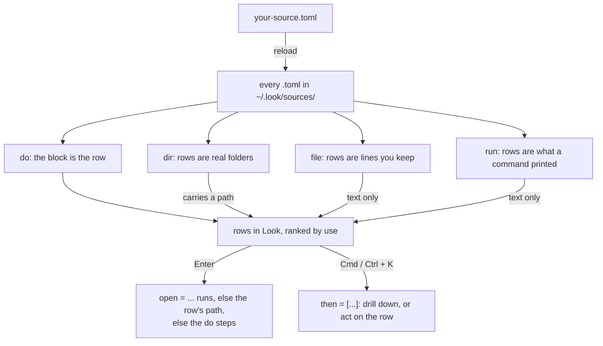

# lookbook

Ready-made sources for [Look](https://github.com/kunkka19xx/look). Copy a file, reload, done.

A **source** is a small TOML file that adds your own rows to Look: your repos, your SSH hosts, your morning routine. One folder here is one topic, holding a README and one or more `.toml` files you can install independently.

New to sources? Read the [format guide](https://github.com/kunkka19xx/look/blob/main/docs/user-sources.md) first. It is short.

> **Needs Look v0.6.12 or newer.** Earlier builds do not read `~/.look/sources/`, so nothing here will appear. 0.6.12 is not released yet: [build from source](https://github.com/kunkka19xx/look/blob/main/DEVELOPMENT.md) to try these today.

**_Tmux source in action_**  


## How a source works

One block, one producer key, rows in the launcher. That is the whole model:



Four things the picture leaves out:

- **A file holds as many blocks as you like**, one producer each. `examples/docker` is one file with three: a `run` block listing containers, and two `do` blocks it reaches with `then`.
- **A path row can do more than a text row.** `dir` rows are real filesystem objects, so `{path}`, `Cmd+E`, `Cmd+T` and `Cmd+F` work and Enter opens the folder with no `open` declared. `file` and `run` rows are text: give them an `open`, or `format = "json"` to carry a path and a per-row icon.
- **Every step is shell text**, run through your login shell (`$SHELL -lc`, or `cmd /D /S /C` on Windows), so `&&`, `|`, `>`, `$VAR` and globs work. That is a *non-interactive* shell: it never reads `~/.zshrc`, so a `PATH` entry or alias living there is missing — move it to `~/.zshenv`, or name the binary in full. fish and nu are passed over for `/bin/sh`. A script can read `LOOK_ID`, `LOOK_TITLE` and `LOOK_PATH` instead of taking arguments.
- **A producer that names a placeholder is not a top-level row.** `run = "git -C {path} branch"` means nothing with no project selected, so Look indexes it only as another block's `then` target.

In a real file: `[dev-projects]` is the block, `dir = "~/dev"` is the producer that turns your folders into rows, and `edit = "code {path}"` is what one of those rows does on `Cmd+E`.

## Install any example

```bash
cp examples/<name>/*.toml ~/.look/sources/
```

Or copy a single file out of a folder if you only want that one.

Then reload Look: `Cmd+Shift+;` on macOS, `Ctrl+Shift+;` on Linux and Windows.

Copy only the `.toml`. Look reads `~/.look/sources/` flat, so it never looks inside subdirectories, and a stray `README.md` in there is reported as an ignored file. If an example ships a script in `bin/`, its README says where to put it.

## Change it to fit your machine

Every file here was written against somebody else's setup, and what makes an example useful is exactly what makes it personal: a projects directory, a terminal, an editor. Open the `.toml` and change those lines before you reload.

The four that catch people:

- **A path that is not yours.** `dev-projects` lists `~/dev`. If your repos are in `~/code` or `~/work`, you get an empty list and nothing else.
- **An app you do not have.** `ssh` and `docker` open Ghostty, `homebrew` upgrades in it, `tmux` attaches with WezTerm, `work-setup` opens Slack, Ghostty and Safari, `dev-projects` edits with `code`.
- **`open`, which is macOS.** On Linux that is `xdg-open`, on Windows `start ""`. Most of these were tested on macOS only; the table below says which.
- **A file that has to be there.** `ssh` reads your `~/.ssh/config`. Anything shipping a `bin/` script needs that script in `~/.look/bin/` first, which its README tells you.

Each example's README has a **Customise** section naming the two or three lines people change first, with the Linux and Windows variants written out. That is the section to read before you reload.

**A mismatch is quiet in the UI.** A `dir` that is not there gives you an empty list, and Enter on a row naming an app you do not have does nothing at all. The reason goes to stderr rather than into the window, so launch Look from a terminal while you are setting these up:

```
look sources: [dev-projects] could not read /home/you/dev
```

Every line it prints starts `look sources:` and names the block, which is the fastest way to tell a source that is misconfigured from one that is simply empty.

## The examples

The **Platforms** column is what the author tested, not what might work. Where an example needs a change to run elsewhere, its README says which line.

| Example                               | Tools      | Shows off                                                     | Platforms             |
| ------------------------------------- | ---------- | ------------------------------------------------------------- | --------------------- |
| [work-setup](examples/work-setup)     | none       | `do`: one row, several apps                                   | macOS                 |
| [dev-projects](examples/dev-projects) | none       | `dir`: rows from a directory, custom verbs                    | macOS, Linux, Windows |
| [ssh](examples/ssh)                   | ssh        | `run`: rows from a command, and the `file` alternative        | macOS                 |
| [git](examples/git)                   | git        | two files in one folder; drill-downs, `confirm`, `{parent.*}` | macOS, Linux, Windows |
| [docker](examples/docker)             | docker, jq | `format = "json"`, per-row icons, a helper script             | macOS                 |
| [tmux](examples/tmux)                 | tmux       | a `bin/` script doing real work; session per project          | macOS                 |
| [browser-history](examples/browser-history) | sqlite3    | `run` + `format = "json"`: favicons as per-row icons, browsers picked by env var | Linux, macOS          |
| [close-windows](examples/close-windows) | jq (Linux) | a multi-line `do` step; `confirm` on something irreversible; one file per OS | Linux (sway; more untested), macOS |
| [systemd](examples/systemd)           | systemd    | tab-separated rows, `preview` from a log, three guarded actions      | Linux                 |
| [bookmarks](examples/bookmarks)       | none       | `file`: a list you keep by hand, and the no-TOML script trick        | Linux                 |
| [shortcuts](examples/shortcuts) | none       | `run` with nothing to install; a `then` drill-down by folder         | macOS                 |
| [homebrew](examples/homebrew) | brew, jq   | two lists in one folder; `confirm` on Enter, and a `preview` that has to be fast | macOS                 |
| [niri](examples/niri)                 | niri, swww, wl-clipboard | image rows with previews; which block shape can warn a tool is missing | Linux (niri)          |

## Read before you install

Every example runs shell commands on your machine when you press Enter. They are short and readable on purpose: **open the `.toml` and read it before you install it**, the same way you would read a shell script someone handed you. Nothing here downloads anything or pipes a URL into a shell, and anything destructive asks first.

Most of them touch only what you point them at. One does not, on purpose: [browser-history](examples/browser-history) finds your browser profiles by itself and makes your history searchable in the launcher, which is the whole idea but also the one thing here worth reading about **before** installing rather than after. Its README opens with what that means and how to narrow it.

## Contributing

Yes please. `make new NAME=tmux` scaffolds one with every rename already done. One folder per example, [the checklist is short](CONTRIBUTING.md), and CI parses every file with Look's own parser so a typo cannot reach anyone. Two things we ask beyond that: **install it and use it before you commit** (parsing is not running), and **say which platforms you actually tested on**.

## License

MIT. Use these however you like.
