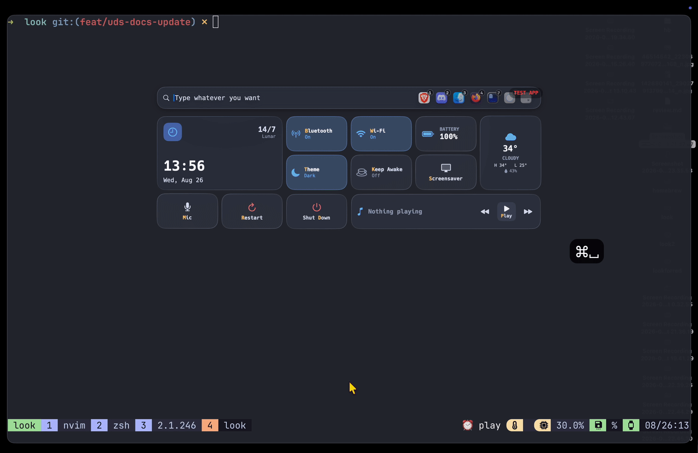

# tmux

One session per project, opened in the terminal you are **already** in. Select a project, `Cmd+K`, **Open in tmux**: if a terminal is attached to tmux anywhere, that client is switched to the project's session and raised, rather than a second window appearing. A session is created if there is not one yet, and a terminal is spawned only when nothing is attached at all.

Separately, `tmux-sessions` lists the sessions you already have, wherever you are, with window counts and whether each is live somewhere else.

 

**Requires.** Look v0.6.12 or newer, `tmux`, and a terminal emulator.

**Platforms.** macOS. The session logic is portable, but raising the terminal uses `open -a`, so Linux and Windows need a few lines changed in `bin/tmux-open`, see Customise.

## Install

```bash
cp examples/tmux/*.toml ~/.look/sources/
mkdir -p ~/.look/bin && cp examples/tmux/bin/tmux-open ~/.look/bin/
chmod +x ~/.look/bin/tmux-open
```

`tmux-open` is reached from a project row, so point your projects block at it. With [dev-projects](../dev-projects), add one line to `~/.look/sources/dev-projects.toml`:

```toml
then = ["tmux-open"]
```

Reload with `Cmd+Shift+;` (macOS) or `Ctrl+Shift+;` (Linux, Windows).

## Blocks

| Block | Lists | Enter |
| --- | --- | --- |
| `tmux-open` | on a project, via `Cmd+K` | switches to that project's session, creating it if needed |
| `tmux-sessions` | every tmux session | attaches to it in a new terminal |

`tmux-open` never appears when you type: it names `{path}`, so Look reaches it only through `then`. `tmux-sessions` is a top-level row, so `tm` finds it.

## Customise

Everything worth changing in the script is in two sections at the top of `bin/tmux-open`, above any logic. Each setting is also an environment variable, so you can try a change without editing the file:

| Setting | Does |
| --- | --- |
| `TERMINAL` | which terminal to spawn when nothing is attached |
| `RAISE_TERMINAL` | bring the terminal to the front after switching. `0` for a tiling WM that does this for you |
| `ALWAYS_NEW_WINDOW` | `1` for a window per project, never reusing an attached client |
| `UNSAFE_CHARS` | characters replaced with `_` in the session name |

```bash
LOOK_TMUX_TERMINAL=kitty ~/.look/bin/tmux-open ~/dev/look
```

Below them are two functions with the alternatives already written as commented lines: `spawn_terminal()` (ghostty/kitty/alacritty, wezterm, gnome-terminal, Windows Terminal) and `raise_terminal()`, which is the macOS-only part. On Linux, replace its `open -a` lines with `wmctrl -a`, or whatever your window manager uses to focus a window.

**Cmd+T as well as Cmd+K.** `terminal` is one of the four verbs every row has, so declaring it on your projects block makes `Cmd+T` mean "the tmux session for this project" for those rows only, while every other row in Look still uses the terminal from `~/.look/config`:

```toml
terminal = "~/.look/bin/tmux-open {path}"
```

**In `tmux-sessions`**, `open` is written for wezterm. Swap it for your terminal: `ghostty -e tmux attach -t \={id}`, `kitty tmux attach -t \={id}`.

## Two things that will bite you

**`=name` is tmux's exact-match target.** Without the `=`, a session called `look` also matches `lookbook`, and you land in the wrong one.

**`\={id}`, with the backslash and no quotes of your own**, in `tmux-sessions.toml`:

| Written as | tmux receives | Why |
| --- | --- | --- |
| `"={id}"` | `='look'` | placeholders arrive already shell-quoted, and a template never quotes them again |
| `={id}` | `/usr/bin/look` | zsh's equals-expansion resolves `=look` as a command |
| `\={id}` | `=look` | correct: that exact session name |

Session names also swap `.` and `:` for `_`, because tmux reads both as target separators. A session named after `present.nvim` could otherwise be created and then never addressed again.
